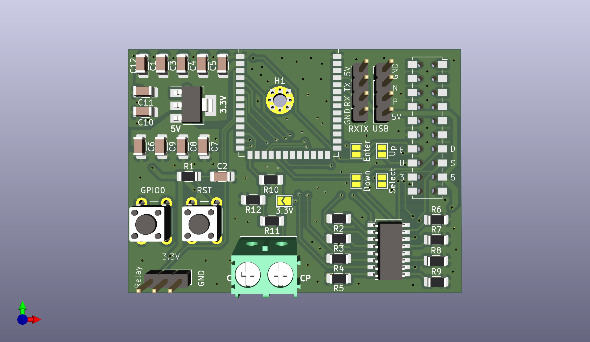
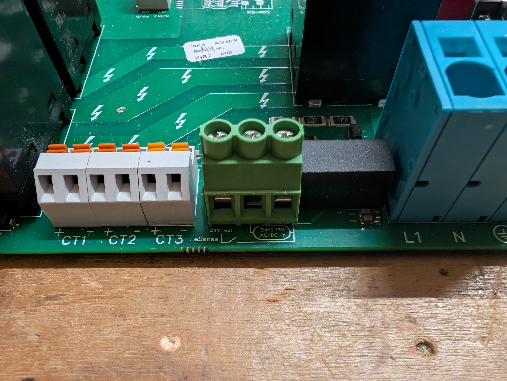
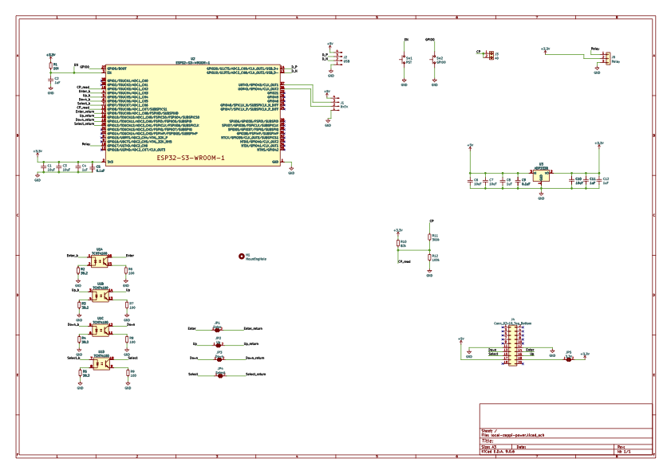

# Myenergi Zappi V2.x Local Controller (ESP32-S3)

<p align="center">
  
  
</p>

A dedicated hardware implant for Myenergi Zappi V2.x EV Chargers. This project interfaces directly with the Zappi's internal control bus to provide **Local MQTT**, **Home Assistant**, and **Web Control** without relying on the Myenergi Cloud or Hub.

## ⚠️ DANGER: HIGH VOLTAGE
**This device is installed INSIDE a 240V/400V EV Charger.**
* **Isolate power completely** at the consumer unit/breaker before opening the Zappi.
* High voltage components are centimeters away from the installation area.
* **Use at your own risk.** Improper installation can damage your charger, vehicle, or cause injury.

## 🔌 How It Works
This PCB intercepts the connection between the Zappi **Main Control Board** and the **Front Panel (Display & Buttons)**.

1.  **Power (5V):** Draws power directly from the Zappi's internal 5V rail (no external USB power needed).
2.  **Button Interface:**
    * **Read Mode:** Monitors the 4 physical buttons (Enter, Up, Down, Select) so you can still use the Zappi manually.
    * **Write Mode:** Simulates button presses using Optocouplers/Relays, allowing you to control the menu remotely via WiFi.
3.  **J1772 Pilot Reading:**
    * Taps into the CP (Control Pilot) line to detect accurate Status (A-F) and PWM Duty Cycle (Amps).


## 🛠️ Hardware Interface
The design utilizes an **ESP32-S3-WROOM-1** and integrates via the internal 20-pin Ribbon Header.

| Signal | Function | Connection |
| :--- | :--- | :--- |
| **5V / GND** | Power Supply | Taken from Zappi internal header. |
| **Buttons** | Enter, Up, Down, Select | **Bi-directional:** Reads physical presses & triggers simulated presses via Optocouplers (TCMT4100). |
| **CP Signal** | J1772 State Detection | Read ±12V Pilot Signal. |
| **Boost Relay** | e-Sense Port trigger | Enable via relay. |

### Pinout Configuration (ESP32-S3)
*Based on PCB Revision 1.1*
* **Button Inputs:** GPIO 4, 5, 6, 7
* **Button Triggers:** GPIO 12, 13, 14, 15
* **CP Signal (ADC):** GPIO 8
* **CP Interrupt:** GPIO 3
* **Relay:** GPIO 17


## 💻 Software / Firmware
This project supports two firmware paths depending on your needs:

### Option A: ESPHome (Not complete yet)
Best for **Home Assistant** users. Provides native integration with zero coding.
* Exposes Buttons as simple HA Switches.
* Exposes Charging Amps and State as Sensors.
* **Config:** Copy `esphome/zappi.yaml` and `esphome/zappi_logic.h` to your ESPHome directory.
* Limitations: Does not monitor or track the menu position. The monitoring of the Zappi buttons is not tested yet.

### Option B: Custom C++ Firmware
Best for standalone use or custom MQTT setups.
* **Features:** Web Interface, WebSocket Live Data, WebSerial, OTA Updates.
* **Tech Stack:** PlatformIO, AsyncWebServer.

## 🔐 Configuration (Custom Firmware)

To keep your WiFi and MQTT passwords safe, this project uses a separate credentials file that is **ignored by Git**.

### 1. Create `src/credentials.cpp`
Create a new file in the `src/` folder named `credentials.cpp` and copy the code below. **Update the values with your actual network details.**

```cpp
#include "credentials.h"
#include <Arduino.h> // for IPAddress

// WiFi Credentials
const char* ssid = "YOUR_WIFI_SSID";
const char* password = "YOUR_WIFI_PASSWORD";

// MQTT Broker Details
const char* mqttServer = "192.168.1.50";
const int mqttPort = 1883;
const char* mqttUser = "homeassistant";
const char* mqttPassword = "mqtt_password";
const char* mqttClientId = "Zappi_Controller";

// Static IP Configuration (Optional)
// Set to 0.0.0.0 if you want to use DHCP
IPAddress staticIP(192, 168, 1, 200);
IPAddress gateway(192, 168, 1, 1);
IPAddress subnet(255, 255, 255, 0);
```

## ⚡ Installation (Custom Firmware / PlatformIO)

This method allows you to use the full Web Interface and custom C++ logic.

### 1. Initial Setup (USB)
1.  Clone this repository and open the `firmware_custom` folder in **VS Code** with the **PlatformIO** extension installed.
2.  Connect your ESP32-S3 to your computer via USB.
3.  Open `platformio.ini` and ensure the OTA lines are **commented out** (so it uses USB upload by default):
    ```ini
    ; upload_protocol = espota
    ; upload_port = 192.168.1.X
    ```
4.  Click the **Upload** arrow (→) in the bottom toolbar to flash the firmware.

### 2. Upload the Web Interface (Filesystem)
The HTML files live in a separate partition called LittleFS. You must upload this once, or the web page will be blank.

1.  Click the **PlatformIO Alien Icon** on the left sidebar.
2.  Navigate to: **Project Tasks** → **Platform**.
3.  Click **Upload Filesystem Image**.
4.  Wait for the success message. Your ESP32 will reboot.
5.  The HTML can be updated directly from the webserver later via an Upload page.

### 3. Connect & Use
1.  Search for the WiFi Network: `Zappi-AP` (Password: `password123` or as configured).
2.  Navigate to `http://192.168.4.1` (or the IP assigned by your router).
3.  You should see the Zappi Control Dashboard.

### 4. Future Updates via OTA (Wireless)
Once the device is installed inside the Zappi case, you can update it wirelessly:
1.  Find the IP address of your Zappi Controller (e.g., `192.168.1.50`).
2.  Edit `platformio.ini` and uncomment the OTA lines:
    ```ini
    upload_protocol = espota
    upload_port = 192.168.1.50  ; Replace with your actual IP
    ```
3.  Click **Upload** in PlatformIO. It will now flash over WiFi.


## 🔧 Hardware Installation Guide
1.  **Power Off:** Turn off the Zappi at the breaker.
2.  **Open Case:** Remove the front fascia and unscrew the main cover.
3.  **Locate Header:** Find the 20-pin pin header connecting the main PCB to the screen module.
4.  **Seperate boards:** Use a needle nose pliers to compress each corner connecting pin and carfully seperate the boards.

5.  **Extend Header:** Extend the header using this component Samtec EW-10-12-G-D-250 or this one EW-10-13-G-D-200.
6.  **Connect:** With the extended header connect the boards back together and then attach the ESP32 board.

7.  **Connect CP:** Attach the single sensing wire to the CP terminal block.

8.  **e-Sence:** Attached the 24V output of the zappi power board to the Common Relay connector and the Normally Closed to the e-Sence input on the zappi power board.

9.  **Wifi:** Attach the Zappi existing antenna to the new board or install a new on. Or else create it with this varient ESP32-S3-WROOM-1-N8R2
10.  **Close & Power Up:** Reassemble and restore power.


## 🔌 Schematic

*[Download Full PDF Schematic](docs/local-zappi-power.pdf)*

## 🧩 Bill of Materials (BOM)

This project requires a custom PCB or a perfboard setup designed to fit inside the Zappi case.
There is more Decoupling capacitators than required. Sometimes the power rails dip when the Zappi triggers its own relays. 

### Active Components
| Ref | Component | Description | Notes |
| :--- | :--- | :--- | :--- |
| **U2** | **ESP32-S3-WROOM-1** | MCU Module | Schematic specifies WROOM-1 (PCB Antenna). If using the `1U` version, connect an external IPEX antenna. |
| **U3** | **ADP3338** | 3.3V LDO Regulator | Steps down the Zappi 5V rail to 3.3V for the ESP32. |
| **U1** | **TCMT4100** | Quad Optocoupler | **U1:** Simulates button presses. |

### Passive Components
| Ref | Value | Quantity | Description |
| :--- | :--- | :--- | :--- |
| **R1** | **10kΩ** | 1 | Pull up to 3.3V for ESP32 Enable Pin. |
| **R2-R5** | **39.2Ω** | 4 | Current limiting for Optocoupler LEDs. |
| **R6-R9** | **100Ω** | 4 | Pull/Protection for button return lines. |
| **R10** | **82kΩ** | 1 | Pull up to 3.3V Pilot Signal divider (CP to ADC), 1% Tolerance required. |
| **R11** | **300kΩ** | 1 | High-side Pilot Signal divider (CP to ADC), 1% Tolerance required. |
| **R12** | **100kΩ** | 1 | Low-side Pilot Signal divider (ADC to GND), 1% Tolerance required. |
| **C6, C7, C10, C1, C3** | **10µF** | 4 | Bulk capacitance for LDO & 3.3V Rails. |
| **C2, C4, C8, C11, C12** | **1µF** | 4 | Stability capacitance for LDO. |
| **C5, C9** | **0.1µF** | 2 | Decoupling for ESP32 and Power rails. |

### Connectors
| Component | Quantity | Purpose |
| :--- | :--- | :--- |
| **20-Pin Header** | 1 | 2x10 Samtec (HLE-110-02-L-DV-BE-K-TR) to interface with Zappi mainboard. |
| **2-Pin Terminal** | 1 | Screw terminal for CP (Pilot) wire connection. |
| **3-Pin Header/Terminal** | 1 | Optional Relay/GPIO breakout (JP5). |
| **Buttons** | 2 | Reset and GPIO 0 button. |
| **Mini Relay** | 1 | Optional: Adafruit STEMMA Non-Latching Mini Relay. |


## 🧪 Testing the CP (Pilot) Signal (Optional Extra)

The Control Pilot (CP) line communicates the state of the EVSE to the car using specific voltage levels (+12V, +9V, +6V) and a 1kHz PWM signal.

Since we are using a **Passive Resistor Divider (300kΩ / 100kΩ)**, it is critical to verify the voltage levels before relying on the automation.

### 1. Bench Testing 
Before installing the unit into the Zappi, you can verify the voltage divider logic using a DC Power Supply or a simple 9V battery.

1.  **Disconnect the ESP32** (if possible) or ensure it is unpowered.
2.  **Apply Voltage** to the CP Terminal on your custom board:
    * **Input 12V:** Measure the voltage at the ESP32 GPIO 8 pin. It should be **~3.0V**.
    * **Input 9V:** Measure the voltage at GPIO 8. It should be **~2.25V**.
3.  **Verify:** If you see >3.3V at the GPIO pin, **STOP**. Your resistor values are incorrect, and you risk frying the ESP32.

### 2. Live Signal Verification
Once installed in the Zappi, use the **WebSerial** (Custom Firmware) or **Home Assistant Logs** (ESPHome) to view the raw ADC readings.

#### Expected ADC Values (12-bit Resolution)
The code looks for the **Peak Voltage** of the signal. Here is what you should see in the logs:

| State | J1772 Voltage | Divider Output | Target ADC Raw |
| :--- | :--- | :--- | :--- |
| **A (Unplugged)** | +12V | ~3.0V | **3600 - 4095** |
| **B (Connected)** | +9V | ~2.25V | **3100 - 3600** |
| **C (Charging)** | +6V (PWM) | ~1.5V | **2500 - 3100** |
| **D (Ventilation)** | +3V (PWM) | ~0.75V | **1900 - 2500** |
| **F (Error/Fault)** | -12V | -3.0V* | **< 1500** |

*> **Note:** The passive divider will pass negative voltages to the GPIO. Ensure your protection diode is in place, or that the ESP32 inputs are clamped effectively to prevent damage during State F.*

### 3. Verifying Amperage (PWM)
When the car enters **State C (Charging)**, the Zappi generates a 1kHz Square Wave.
1.  Check the **"Zappi Duty Cycle"** sensor.
2.  Compare it to the Zappi Screen.
    * **Formula:** `Amps = Duty Cycle x 0.6`
    * *Example:* A 50% Duty Cycle should display as **30A**.